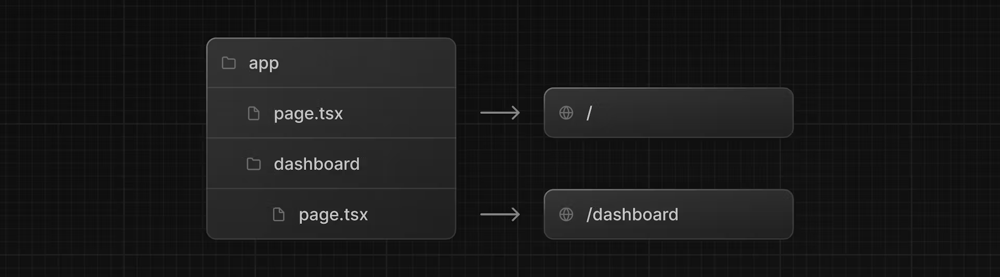

Mixture of my understanding, [nextjs learn](https://nextjs.org/learn) and [docs](https://nextjs.org/docs)

[sample project](https://github.com/chris-p-dev/thenextthing)

### Project Structure

**/app** - App Router  
**/pages** - Pages Router  
**/public** - Static assets to be served  
**/src** - Optional application source folder  
**/next.config.js** - configuration file

### File Conventions

special files that have specific behavior
`.js`, `.jsx` or `.tsx` file extensions can be use for special files

**layout** - Shared UI for a segment and its children, automatically receives props for children, the children is a nested page.tsx
**page** - Unique UI of a route and make routes publicly accessible,autmatically receives props for children, the children is a nested page.tsx
**loading** - Loading UI for a segm and its children
**not-found** - Not found UI for a segment and its children
**error** - Error UI for a segment and its children

##### Colocation

we can combine other files (tests, assets, stylings ) inside `/app` director because `page` and `route` are made public(Routable)

### Routing

##### Nested Routing


file-system routing where folders are used to create nested routes. Each folder represents a route segment that maps to a URL segment.

To create a nested route, you can nest folders inside each other and add page.tsx files inside them. For example:



You can create separate UIs for each route using `layout.tsx` and `page.tsx` files.

The `<Layout />` component receives a children prop. This child can either be a page or another layout. In your case, the pages inside /dashboard will automatically be nested inside a `<Layout />`

##### Navigating

`Link` component to redirect to pages

```ts
// some page or ui component
import Link from 'next/link';
<Link href="/dashboard/invoices" className=" text-whitetransition-colors hover:bg-blue-400" >
    Go Back
</Link>
```

### Server Actions

asynchronous functions that are executed on the server. They can be used in Server and Client Components to handle form submissions and data mutations in Next.js applications.

- eliminate the need to create API endpoints to mutate your data. Instead, you write asynchronous functions that execute on the server and can be invoked from yo
  ur Client or Server Components.

##### Convention

use the inline function level or module level `"use server"`

###### Server Components

Sample server Component

```ts
'use server'; // this will inlive  server action
import { signIn } from '@/auth';
import { AuthError } from 'next-auth';
import { z } from 'zod';
import { sql } from '@vercel/postgres';
import { revalidatePath } from 'next/cache';
import { redirect } from 'next/navigation';

// typings
export type State = {
  errors?: {
    customerId?: string[];
    amount?: string[];
    status?: string[];
  };
  message?: string | null;
};

// form validation like zod
const FormSchema = z.object({
  id: z.string(),
  customerId: z.string({
    invalid_type_error: 'Please select a customer.',
  }),
  amount: z.coerce
    .number()
    .gt(0, { message: 'Please enter an amount greater than $0.' }),
  status: z.enum(['pending', 'paid'], {
    invalid_type_error: 'Please select an invoice status.',
  }),
  date: z.string(),
});

// Use Zod to update the expected types
const UpdateInvoice = FormSchema.omit({ id: true, date: true });

// action to invoke
export async function updateInvoice(
  id: string,
  prevState: State,
  formData: FormData,
) {
  const validatedFields = UpdateInvoice.safeParse({
    customerId: formData.get('customerId'),
    amount: formData.get('amount'),
    status: formData.get('status'),
  });

  if (!validatedFields.success) {
    return {
      errors: validatedFields.error.flatten().fieldErrors,
      message: 'Missing Fields. Failed to Update Invoice.',
    };
  }

  const { customerId, amount, status } = validatedFields.data;
  const amountInCents = amount * 100;
  // some transaction
  try {
    await sql`
      UPDATE invoices
      SET customer_id = ${customerId}, amount = ${amountInCents}, status = ${status}
      WHERE id = ${id}
    `;
  } catch (error) {
    return { message: 'Database Error: Failed to Update Invoice.' };
  }

  revalidatePath('/dashboard/invoices');
  redirect('/dashboard/invoices');
}

// revalidatePath -  allows you to purge cached data on-demand for a specific path.
// redirect - function allows you to redirect the user to another URL.
```

### Client Components

Client Components allow you to write interactive UI that is prerendered on the server and can use client JavaScript to run in the browser.

Benefits:

- Interactivity: Client Components can use state, effects, and event listeners, meaning they can provide immediate feedback to the user and update the UI.
- Browser APIs: Client Components have access to browser APIs, like geolocation or localStorage.

Sample code

```ts
'use client'; // add "use client directive on the top of the file"
// This means that by defining a "use client" in a file, all other modules imported into it, including child components, are considered part of the client bundle.


import { useEffect } from 'react';

export default function Error({
  error,
  reset,
}: {
  error: Error & { digest?: string };
  reset: () => void;
}) {
  useEffect(() => {
    // Optionally log the error to an error reporting service
    console.error(error);
  }, [error]);

  return (
    <main className="flex h-full flex-col items-center justify-center">
      <h2 className="text-center">Something went wrong!</h2>
      <button
        className="mt-4 rounded-md bg-blue-500 px-4 py-2 text-sm text-white transition-colors hover:bg-blue-400"
        onClick={
          // Attempt to recover by trying to re-render the invoices route
          () => reset()
        }
      >
        Try again
      </button>
    </main>
  );
}
```

Diagram when not using "use client" and making component be interactive


### Partial Prerendering

serves a static page with dynamic holes for fast page initial load

- A static route shell is served, ensuring a fast initial load.
- The shell leaves holes where dynamic content will load in asynchronous.
- The async holes are streamed in parallel, reducing the overall load time of the page.

To enable this:

```ts #16
// next.config.js
experimental: {
        ppr: true,
},
```

Make use of Suspense `<Suspense>`

```ts
// some component with dynamic content
 return (
    <div className="w-full">
      <div className="flex w-full items-center justify-between">
        <h1 className={`${lusitana.className} text-2xl`}>Invoices</h1>
      </div>
      <div className="mt-4 flex items-center justify-between gap-2 md:mt-8">
        <Search placeholder="Search invoices..." />
        <CreateInvoice />
      </div>
      <Suspense key={query + currentPage} fallback={<InvoicesTableSkeleton />}>
        <Table query={query} currentPage={currentPage} />
      </Suspense>
      <div className="mt-5 flex w-full justify-center">
        <Pagination totalPages={totalPages} />
      </div>
    </div>
  );
}
```

### Error Handling

Adding these on the route segments can show or display page for Error Handling

##### Error Page

Added Error page on either root or specific route segment/file structure.

Example:  


```js
// somewhere server action or any API handling
....
export async function deleteInvoice(id: string) {
  throw new Error('Failed to Delete Invoice');
....

//  Error page will be shown through `error.tsx` page

```

##### Not Found

Added `not-found.tsx` file on a Route Segment

```ts
// some page.tsx
import { notFound } from 'next/navigation';
export default async function Page({ params }: { params: { id: string } }) {
  const id = params.id;
  if (!id) {
    notFound();
  }
...
// this will display `not-found.tsx`
```

### Accessibility

Improve Accessibility by using:

- **Semantic HTML**: Using semantic elements (`<input>`, `<option>`, etc) instead of `<div>`. This allows assistive technologies (AT) to focus on the input elements and provide appropriate contextual information to the user, making the form easier to navigate and understand.
- **Labelling**: Including <label> and the htmlFor attribute ensures that each form field has a descriptive text label. This improves AT support by providing context and also enhances usability by allowing users to click on the label to focus on the corresponding input field.
- **Focus Outline**: The fields are properly styled to show an outline when they are in focus. This is critical for accessibility as it visually indicates the active element on the page, helping both keyboard and screen reader users to understand where they are on the form. You can verify this by pressing tab.

### MetaData

- Filebase:
  - favicon.ico, apple-ico.jpg, icon.jpg - favicons and icons
  - opengraph-image.jpg, twitter-image.jpg - social media images
  - robots.txt - search engine crawling
  - sitemap.xml - websites structure

Adding metadata through `page` or `layout`

##### Individual Page

```ts
import { Metadata } from 'next';

export const metadata: Metadata = {
  title: 'Invoices | Acme Dashboard',
};
```

##### Template

```ts
// main layout
import { Metadata } from 'next';

export const metadata: Metadata = {
  title: {
    template: '%s | Acme Dashboard',
    default: 'Acme Dashboard',
  },
  description: 'The official Next.js Learn Dashboard built with App Router.',
  metadataBase: new URL('https://next-learn-dashboard.vercel.sh'),
};

// testpage
export const metadata: Metadata = {
  title: 'Invoices',
};

// this concatinates string into `Invoices | Acme Dashboard` when accessing the /testpage
```
